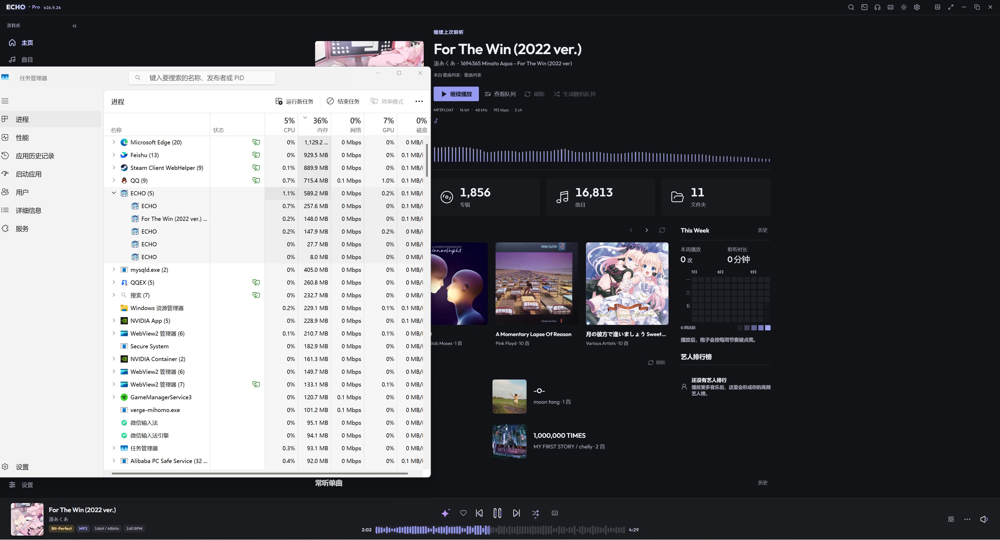
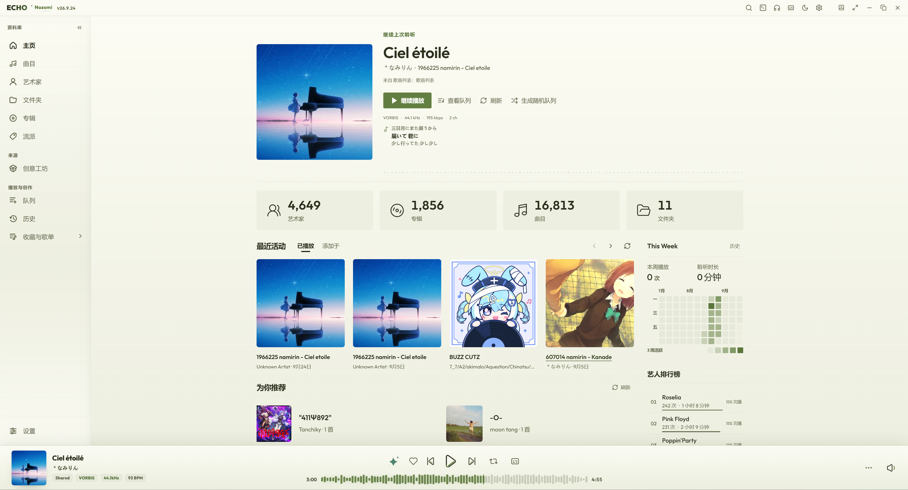
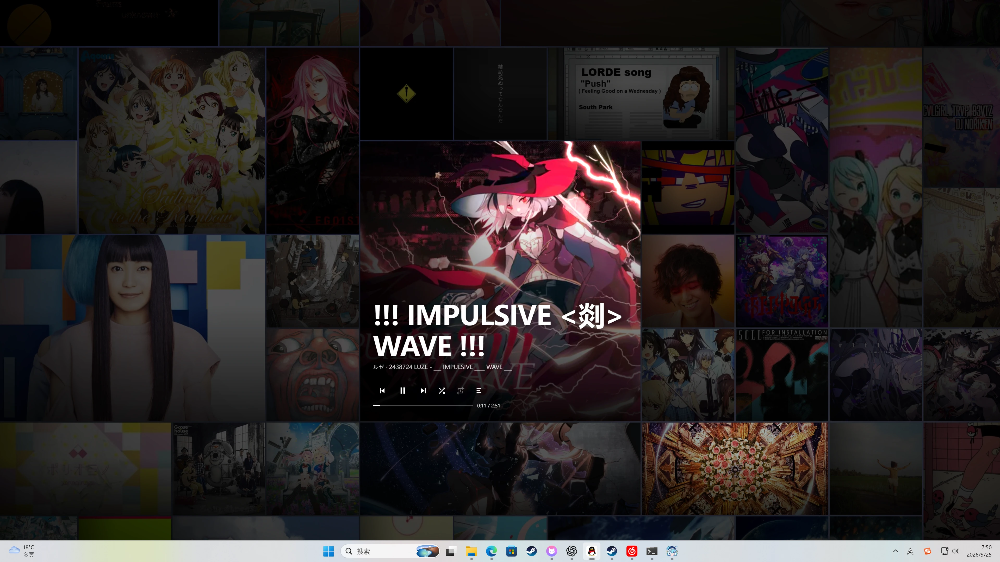
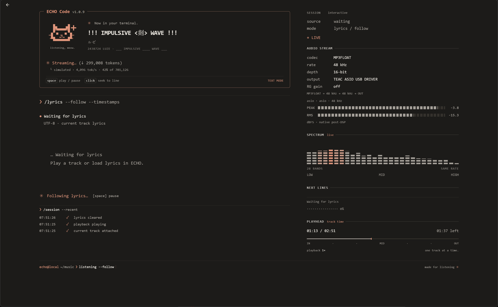

  

<h1 align="center">ECHO</h1>

<strong>Make your music library your own.</strong>

  A desktop player built around local music, thoughtful library management, and dependable playback.

  
  
  

  
  
  
  
  

  <a href="https://store.steampowered.com/app/5105090/ECHO/">Explore ECHO on Steam</a>
  &nbsp;·&nbsp;
  <a href="https://github.com/Moekotori/ECHO/releases">Get the community edition</a>
  &nbsp;·&nbsp;
  <a href="https://echonext.moe/zh/docs/">Documentation</a>
  &nbsp;·&nbsp;
  <a href="./README.md">简体中文</a>

---

## Community edition: free forever, AGPL open source

The community edition is **free forever**, open source under [AGPL v3](./LICENSE), with maintenance that depends on everyone pitching in. Get the player from [GitHub Releases](https://github.com/Moekotori/ECHO/releases), and help fix issues, improve features, documentation, and translations.

## Steam edition: take listening further

ECHO on Steam keeps your own music at the center, then adds Steam updates, Cloud sync for selected settings, achievements, friend presence, and the Workshop. Organize your library, follow the lyrics, and make the player and your desktop feel like your space.

**All four images below show the Steam edition.**

### 01 / 16,813 tracks, still light on its feet

**16,813 tracks, 1,856 albums, and music playing.** Windows Task Manager shows the ECHO process group using **589.2 MB of memory and 1.1% CPU**. Scanning, metadata work, and playback have distinct responsibilities; low-spec mode and reduced background work keep a large library nimble.

### 02 / Your library, your taste

Artwork, albums, artists, recent listening, lyrics, and queue controls share one desktop interface. Switch between light and dark themes or other visual styles while keeping playback close at hand.

### 03 / Let your desktop move with the music

Turn album covers into a desktop wall and let track information, progress, and visualizations move with the music. ECHO includes a bridge for Wallpaper Engine; creators can start with the [Web wallpaper example](./examples/wallpaper-engine/echo-web-wallpaper/README.md).

### 04 / Give creators the stage

Explore and subscribe to themes, lyric scenes, visualizers, and extensions in the [Steam Workshop](https://steamcommunity.com/app/5105090/workshop/). The **ECHO Code** example below brings synchronized lyrics, playhead, audio-stream details, and a live spectrum into an interactive terminal-style panel.

### Go deeper

| What you want | What ECHO offers |
| --- | --- |
| Listen to your own music | Local library, albums and artists, playlists, dynamic lyrics, and listening history |
| Choose an output path | System output, WASAPI Shared / Exclusive, and ASIO for headphones, speakers, and external DACs |
| See the audio path | Codec, sample rate, output device, and processing status at a glance |
| Change the atmosphere | Themes, visualizers, wallpaper integration, and Workshop creations |
| Use the Steam ecosystem | Updates, Cloud sync for selected settings, achievements, friend presence, and Workshop |

Audio Core and the native host own real playback state. Output modes, device capabilities, and fallback reasons stay traceable, while the interface makes every switch clear.

  <strong>Open your music. Hear your world.</strong> 
  <a href="https://store.steampowered.com/app/5105090/ECHO/">Visit ECHO on Steam →</a>

## License

Copyright (c) 2026 Moekotori.

Project-owned code, documentation, and materials in this repository are licensed under the **GNU Affero General Public License v3.0 (AGPL-3.0-only)** unless a separate license is stated. See [LICENSE](./LICENSE) for the full terms. Third-party components, dependencies, fonts, media tools, and SDKs remain governed by their respective licenses.
